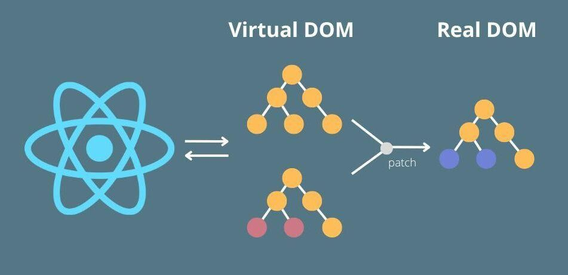

<style>
    section.title {
        background-color: #333;
        display: flex;
        justify-content: space-between;
        padding-top: 6em;
    }
    section.title h1 {
        font-size: 200%
    }
    section.title img {
        float: left;
        margin-right: 1em;
        margin-top: 1em;
        border-radius: 60%;
    }
</style>

<!--
_class: title invert
_footer: ""
_paginate: skip
-->

# Getting Started with React


*How to get started with React framework without a computer science degree*

###


**Jess Chadwick**
_[github.com/jchadwick](https://github.com/jchadwick)_


---

# What is React?

- **JavaScript library** for building user interfaces
- Developed by **Facebook** in 2013
- Component-based architecture
- Manages the **view layer** in web applications
- Used to create **single-page applications** (SPAs)

_React is efficient, declarative, and flexible!_


---

# Key Features of React

1. **Component-Based**

   - Build encapsulated components that manage their own state
   - Components can be reused across the application

2. **JSX Syntax**

   - Write HTML-like syntax directly within JavaScript

3. **Virtual DOM**
   - React uses a virtual DOM to **efficiently update** the UI
   - Only the changes are updated, not the entire page

---

# How React Works

1. **Components**

   - Building blocks of React
   - Each component is like a function that returns HTML

2. **State & Props**

   - **State**: Holds dynamic data inside a component
   - **Props**: Pass data from one component to another

3. **Reactivity**
   - React automatically re-renders the UI when state changes
   - Uses a **diffing algorithm** to apply updates efficiently (Virtual DOM)

---

# JSX: JavaScript + HTML

```jsx
function WelcomeMessage({ name }) {
  return <h1>Welcome, {name}!</h1>;
}

function App() {
  const person = { name: "Frank" };
  return <WelcomeMessage name={person.name} />;
}
```

- React uses **JSX** (JavaScript XML), which allows embedding HTML in JavaScript
- *Transpiled* to regular JavaScript by tools like Babel

---

# Virtual DOM in Action


_[Fidisys](https://www.linkedin.com/company/fidisys/?lipi=urn%3Ali%3Apage%3Ad_flagship3_pulse_read%3BK7kioCELRo2Fv1FufTzMkQ%3D%3D), [LinkedIn](https://media.licdn.com/dms/image/v2/D5612AQHrTcE_Vu_qjQ/article-cover_image-shrink_720_1280/article-cover_image-shrink_720_1280/0/1694674429966?e=1730332800&v=beta&t=jPprwlSJ9A9373G_MEscJaER5eNnPik4VeVuGPrOyDw)_

- Virtual DOM is a lightweight copy of the actual DOM
- When the state changes:
  1. React updates the virtual DOM
  2. It compares the new virtual DOM with the previous one
  3. Only the differences are applied to the real DOM

